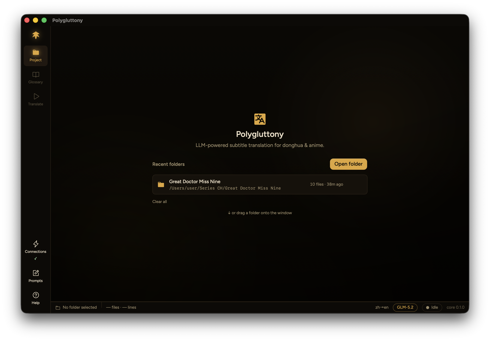

<div align="center">



# Polygluttony

**LLM-powered subtitle translation for donghua & anime — built to protect the things that break.**

[Website](https://pg.blyat.uk) · [Download](../../releases/latest) · macOS · Windows · Linux

</div>

---

Polygluttony translates `.ass` subtitle files with an LLM while guarding against the failure modes that wreck naive machine translation. Point it at a folder, connect a provider (Anthropic, OpenAI, or any OpenAI-compatible endpoint — including Gemini), optionally build a glossary, and run — watching live, honest telemetry the whole way.

## Why it's different

- **Line markers & partial-failure recovery** — every line is tracked, so when a model drops, merges, or reorders lines, Polygluttony detects exactly where it broke and salvages the correct prefix instead of failing the whole batch.
- **Drift detection** — a five-signal weighted detector catches translations wandering off the source mid-batch and retranslates only the part that drifted.
- **Byte-faithful ASS tags** — `{\pos}`, `{\an8}`, fonts, styles, and metadata come back exactly as they went in; only the dialogue is translated.
- **Cross-episode glossary** — a six-category glossary, with auto-detected world type (xianxia / wuxia / historical / modern), keeps names and terms consistent across a whole season.
- **Verification, not a score** — every file checks its own work and surfaces an actionable issue list, never a number.
- **Mission-control UI** — a single window with live, batched telemetry: watch batches land, terms stream into the glossary, and drift get caught in real time.

## Download

Grab the latest build for your OS from the [**Releases**](../../releases/latest) page — macOS (Apple Silicon), Windows, and Linux.

> These builds aren't signed with a paid developer certificate, so the OS warns on first launch:
> - **macOS** — the first launch is blocked. Open **System Settings → Privacy & Security**, scroll to the bottom, and click **Open Anyway**, then launch again and confirm. (Right-click → Open no longer works on recent macOS.)
> - **Windows** — on the SmartScreen prompt, choose **More info → Run anyway**.

## Build from source

Requires [Bun](https://bun.sh) and [Rust](https://rustup.rs) (stable), plus the [Tauri prerequisites](https://tauri.app/start/prerequisites/) for your OS.

```bash
bun install
bun tauri dev      # run with hot reload
bun tauri build    # produce a distributable bundle
```

## Stack

Tauri 2 · Rust · React 19 · TypeScript · Tailwind v4 · TanStack Router/Query.

## License

[MIT](LICENSE).
